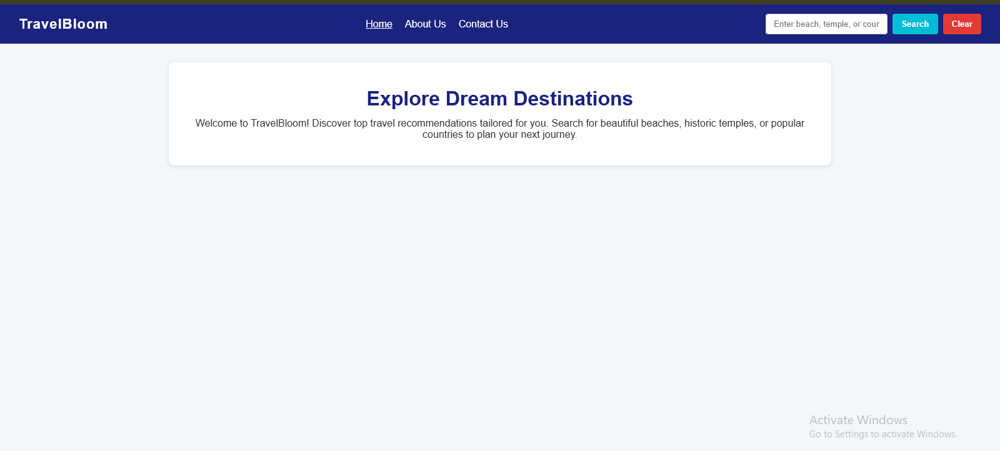
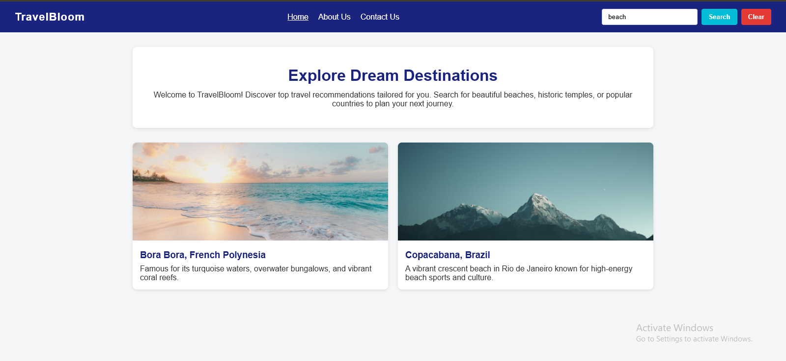
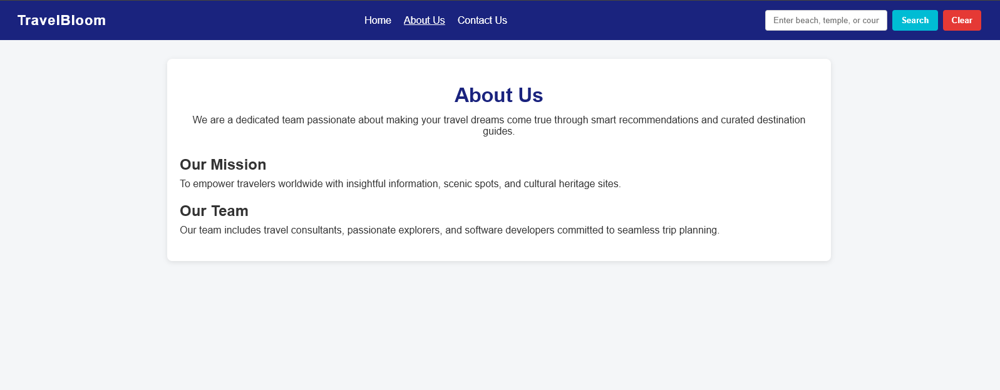
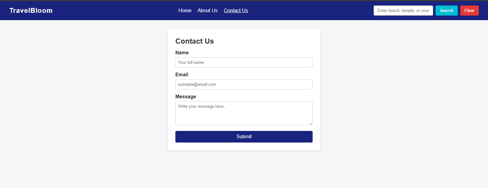

# TravelBloom - Travel Recommendation Web Application

A responsive web application built with HTML5, CSS3, and modern JavaScript that provides personalized travel destination recommendations based on user queries. This project was developed as part of the **IBM JavaScript Programming Essentials** course on Coursera.

---

## 🌐 Live Demo

- **Live Website:** [https://qasimabbasi786.github.io/travel-recommendation-app/](https://qasimabbasi786.github.io/travel-recommendation-app/)
- **Repository:** [https://github.com/qasimabbasi786/travel-recommendation-app](https://github.com/qasimabbasi786/travel-recommendation-app)

---

## 📸 Screenshots

<p align="center">
  
  <br>
  <em>Home Page & Search Interface</em>
</p>

<p align="center">
  
  <br>
  <em>Search Results Display (Beaches / Temples / Countries)</em>
</p>

<p align="center">
  
  <br>
  <em>About Us Interface</em>
</p>

<p align="center">
  
  <br>
  <em>Contact Us Interface</em>
</p>

---

## ✨ Features

- **Dynamic Search Functionality:** Search destinations based on keywords such as `beach`, `temple`, or specific countries like `Australia` and `Japan`.
- **JSON Data Integration:** Fetches destination data asynchronously using the Fetch API (`travel_recommendation_api.json`).
- **Interactive Reset / Clear:** One-click clear functionality to reset the search input field and wipe displayed results.
- **Multi-page Navigation:** 
  - **Home:** Landing banner, interactive search bar, and dynamic recommendation cards.
  - **About Us:** Information regarding the company's background, mission, and team.
  - **Contact Us:** Interactive feedback and inquiry form with field validation.
- **Clean Responsive Design:** Built using flexible layouts, modern CSS cards, and optimized image containers.

---

## 🛠️ Technologies Used

- **HTML5:** Semantic page structures.
- **CSS3:** Custom styling, responsive layouts, and modern UI components.
- **JavaScript (ES6+):** DOM manipulation, Fetch API, asynchronous data handling, event listeners.
- **GitHub Pages:** Static site hosting and deployment.

---

## 📂 Project Structure

```text
travel-recommendation-app/
│
├── index.html                      # Main landing page
├── about.html                      # About Us page
├── contact.html                    # Contact form page
├── travel_recommendation.css       # Global stylesheet
├── travel_recommendation.js        # Core search & rendering logic
├── travel_recommendation_api.json  # Destination data
└── screenshots/                    # Project screenshots for documentation
    ├── home.png
    ├── search_results.png
    └── about_contact.png
```

---

## 🚀 How to Run Locally

1. **Clone the repository:**
   ```bash
   git clone https://github.com/qasimabbasi786/travel-recommendation-app.git
   ```
2. **Navigate into the directory:**
   ```bash
   cd travel-recommendation-app
   ```
3. **Launch the project:**
   - Open `index.html` in your web browser, or use a local server extension such as VS Code Live Server.

---

## 📝 Author

- **Muhammad Qasim** - [GitHub Profile](https://github.com/qasimabbasi786)
